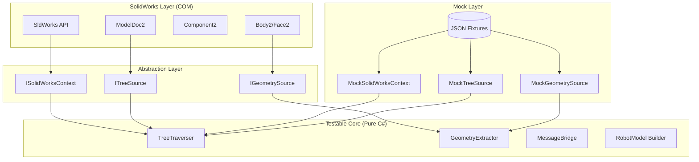
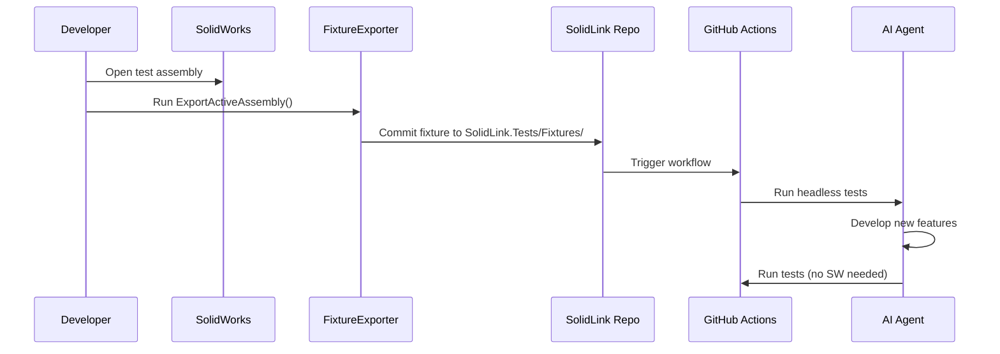
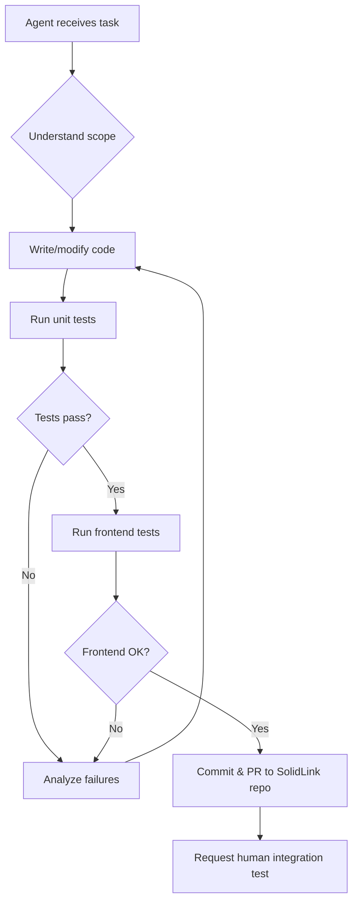

# SolidLink Agent-Friendly Development Toolchain Spec

> [!IMPORTANT]
> **Goal**: Enable AI agents to develop, test, and verify SolidLink plugin features **without requiring SolidWorks to be running**, maximizing autonomous development capability.

## 1. Problem Statement

### Current Challenges

1. **SolidWorks Dependency**: All core services (`TreeTraverser`, `GeometryExtractor`, `MessageBridge`) require a live `SldWorks` COM instance.
2. **Human-in-the-Loop Testing**: Integration testing currently requires:
   - Manual SolidWorks launch
   - Manual assembly file loading
   - Visual inspection of results
3. **Build Lock Issues**: The add-in DLL is locked while SolidWorks runs, blocking iterative development.
4. **Agent Blindness**: AI agents cannot "see" SolidWorks UI or interpret 3D viewport output.

### Success Criteria

| Criterion | Target |
|-----------|--------|
| Unit test coverage for pure logic | 80%+ |
| Agent can run full test suite | Headless, < 60 seconds |
| SolidWorks required for | Integration smoke tests only |
| Agent can verify JSON bridge | 100% without SW |

---

## 2. Repository Structure

All tooling lives **within the SolidLink repository** at `SolidLink/`:

```
SolidLink/                          # Root of SolidLink repo
├── .git/                           # SolidLink's own Git repo
├── .github/
│   └── workflows/
│       └── solidlink-tests.yml     # [NEW] CI workflow
├── docs/
│   └── solidlink-agent-dev-spec.md # This file
├── SolidLink.sln                   # Solution file
├── SolidLink.Addin/                # C# Add-in project
│   ├── Abstractions/               # [NEW] Interface definitions
│   │   ├── ISolidWorksContext.cs
│   │   ├── IModelDocument.cs
│   │   ├── IComponent.cs
│   │   └── IBody.cs
│   ├── Bridge/
│   ├── Model/
│   ├── Services/
│   ├── Tools/                      # [NEW] FixtureExporter
│   │   └── FixtureExporter.cs
│   └── UI/
├── SolidLink.Tests/                # [NEW] Test project
│   ├── SolidLink.Tests.csproj
│   ├── Fixtures/                   # JSON test data
│   │   ├── assembly_simple.json
│   │   ├── assembly_nested.json
│   │   └── ...
│   ├── Mocks/                      # Mock implementations
│   │   ├── MockSolidWorksContext.cs
│   │   ├── MockModelDocument.cs
│   │   └── ...
│   ├── Unit/                       # Unit tests (no SW)
│   │   ├── TreeTraverserTests.cs
│   │   └── ...
│   └── Integration/                # Integration tests (require SW)
│       └── SolidWorksSmoke.cs
├── SolidLink.UI/                   # React/Three.js frontend
│   ├── src/
│   │   ├── test/                   # [NEW] Frontend test utilities
│   │   │   └── MockBridgeServer.ts
│   │   └── ...
│   ├── e2e/                        # [NEW] Playwright tests
│   │   └── viewport.spec.ts
│   └── playwright.config.ts
├── scripts/
│   ├── register.ps1
│   └── nuget.exe
└── packages/
```

---

## 3. Architecture: The Abstraction Layer Strategy

The key insight is to **separate SolidWorks-dependent code from pure business logic** via well-defined interfaces and data transfer objects (DTOs).



---

## 4. Implementation Components

### 4.1. Interface Abstractions

Create interfaces that abstract SolidWorks COM objects. These live in `SolidLink.Addin/Abstractions/`.

#### [NEW] `SolidLink.Addin/Abstractions/ISolidWorksContext.cs`

```csharp
public interface ISolidWorksContext
{
    IModelDocument ActiveModel { get; }
    bool IsConnected { get; }
}
```

#### [NEW] `SolidLink.Addin/Abstractions/IModelDocument.cs`

```csharp
public interface IModelDocument
{
    string Title { get; }
    DocumentType Type { get; }
    IConfiguration ActiveConfiguration { get; }
}

public enum DocumentType { Part, Assembly, Drawing }
```

#### [NEW] `SolidLink.Addin/Abstractions/IComponent.cs`

```csharp
public interface IComponent
{
    string Name { get; }
    IComponent Parent { get; }
    IEnumerable<IComponent> Children { get; }
    IModelDocument ModelDoc { get; }
    double[] TransformMatrix { get; } // 16-element array
}
```

#### [NEW] `SolidLink.Addin/Abstractions/IBody.cs`

```csharp
public interface IBody
{
    string Name { get; }
    IEnumerable<IFace> Faces { get; }
}

public interface IFace
{
    float[] GetTessTriangles();
}
```

---

### 4.2. Mock Implementations

Create mocks that load data from JSON fixture files. These live in `SolidLink.Tests/Mocks/`.

#### Fixture Schema

Store fixtures in `SolidLink.Tests/Fixtures/`:

```json
// SolidLink.Tests/Fixtures/assembly_simple.json
{
  "title": "SimpleRobot",
  "type": "Assembly",
  "rootComponent": {
    "name": "Base-1",
    "transform": [1,0,0,0, 0,1,0,0, 0,0,1,0, 0,0,0,1],
    "children": [
      {
        "name": "Arm-1",
        "transform": [1,0,0,0, 0,1,0,0, 0,0,1,0, 0,0.5,0,1],
        "bodies": [
          {
            "name": "Arm Body",
            "tessellation": [0,0,0, 1,0,0, 0.5,1,0, ...]
          }
        ],
        "children": []
      }
    ]
  }
}
```

#### [NEW] `SolidLink.Tests/Mocks/MockSolidWorksContext.cs`

```csharp
public class MockSolidWorksContext : ISolidWorksContext
{
    private readonly string _fixturePath;
    
    public MockSolidWorksContext(string fixturePath)
    {
        _fixturePath = fixturePath;
    }
    
    public IModelDocument ActiveModel => LoadFromFixture();
    public bool IsConnected => true;
    
    private IModelDocument LoadFromFixture()
    {
        var json = File.ReadAllText(_fixturePath);
        var data = JsonConvert.DeserializeObject<FixtureData>(json);
        return new MockModelDocument(data);
    }
}
```

---

### 4.3. Refactored Services

Modify existing services to accept interfaces instead of COM objects.

#### [MODIFY] `SolidLink.Addin/Services/TreeTraverser.cs`

**Before**:
```csharp
public TreeTraverser(SldWorks app)
{
    swApp = app ?? throw new ArgumentNullException(nameof(app));
}
```

**After**:
```csharp
public TreeTraverser(ISolidWorksContext context)
{
    _context = context ?? throw new ArgumentNullException(nameof(context));
}
```

---

### 4.4. Test Project

#### [NEW] `SolidLink.Tests/SolidLink.Tests.csproj`

```xml
<Project Sdk="Microsoft.NET.Sdk">
  <PropertyGroup>
    <TargetFramework>net48</TargetFramework>
    <IsPackable>false</IsPackable>
  </PropertyGroup>

  <ItemGroup>
    <PackageReference Include="NUnit" Version="3.14.0" />
    <PackageReference Include="NUnit3TestAdapter" Version="4.5.0" />
    <PackageReference Include="Moq" Version="4.20.70" />
    <PackageReference Include="Newtonsoft.Json" Version="13.0.3" />
  </ItemGroup>

  <ItemGroup>
    <ProjectReference Include="..\SolidLink.Addin\SolidLink.Addin.csproj" />
  </ItemGroup>

  <ItemGroup>
    <Content Include="Fixtures\*.json">
      <CopyToOutputDirectory>PreserveNewest</CopyToOutputDirectory>
    </Content>
  </ItemGroup>
</Project>
```

#### Directory Structure

```
SolidLink.Tests/
├── SolidLink.Tests.csproj
├── Fixtures/
│   ├── assembly_simple.json
│   ├── assembly_nested.json
│   ├── part_single_body.json
│   └── assembly_with_coordsys.json
├── Mocks/
│   ├── MockSolidWorksContext.cs
│   ├── MockModelDocument.cs
│   ├── MockComponent.cs
│   └── MockBody.cs
├── Unit/
│   ├── TreeTraverserTests.cs
│   ├── GeometryExtractorTests.cs
│   ├── MessageBridgeTests.cs
│   └── RobotModelBuilderTests.cs
└── Integration/
    └── SolidWorksSmoke.cs  // [Category("RequiresSW")]
```

---

### 4.5. Frontend Testing

The React/Three.js frontend can be tested completely independently.

#### [NEW] `SolidLink.UI/src/test/MockBridgeServer.ts`

```typescript
export class MockBridgeServer {
  private handlers: Map<string, (msg: BridgeMessage) => BridgeMessage>;
  
  send(type: string, payload: unknown): void {
    // Dispatch to registered handlers
  }
  
  loadScenario(path: string): void {
    // Load pre-recorded message sequences
  }
}
```

#### [NEW] `SolidLink.UI/e2e/viewport.spec.ts`

```typescript
import { test, expect } from '@playwright/test';
import fixture from '../src/test/fixtures/assembly_simple.json';

test('renders assembly tree correctly', async ({ page }) => {
  await page.goto('/');
  
  // Inject mock bridge
  await page.evaluate((data) => {
    window.__mockBridge__.send('TREE_RESPONSE', data);
  }, fixture);
  
  await expect(page.locator('[data-testid="tree-root"]')).toBeVisible();
});
```

---

## 5. Fixture Generation Pipeline

### 5.1. Capture Tool

Create a utility mode in the add-in that exports real SolidWorks data to JSON fixtures:

#### [NEW] `SolidLink.Addin/Tools/FixtureExporter.cs`

```csharp
public class FixtureExporter
{
    private readonly SldWorks _swApp;
    
    public FixtureExporter(SldWorks swApp)
    {
        _swApp = swApp;
    }
    
    public void ExportActiveAssembly(string outputPath)
    {
        var model = _swApp.ActiveDoc as ModelDoc2;
        var fixture = BuildFixture(model);
        File.WriteAllText(outputPath, JsonConvert.SerializeObject(fixture, Formatting.Indented));
    }
    
    private FixtureData BuildFixture(ModelDoc2 model)
    {
        // ... traverse and serialize
    }
}
```

### 5.2. Workflow



---

## 6. CI/CD Integration

### [NEW] `.github/workflows/solidlink-tests.yml`

```yaml
name: SolidLink Tests

on:
  push:
    branches: [main, dev]
  pull_request:
    branches: [main]

jobs:
  backend-tests:
    runs-on: windows-latest
    defaults:
      run:
        working-directory: .
    steps:
      - uses: actions/checkout@v4
      
      - name: Setup MSBuild
        uses: microsoft/setup-msbuild@v2
      
      - name: Restore NuGet packages
        run: nuget restore SolidLink.sln
      
      - name: Build
        run: msbuild SolidLink.sln /p:Configuration=Release
      
      - name: Run Unit Tests (No SolidWorks)
        run: dotnet test SolidLink.Tests/SolidLink.Tests.csproj --filter "Category!=RequiresSW"

  frontend-tests:
    runs-on: ubuntu-latest
    defaults:
      run:
        working-directory: SolidLink.UI
    steps:
      - uses: actions/checkout@v4
      
      - name: Setup Node
        uses: actions/setup-node@v4
        with:
          node-version: 20
      
      - name: Install dependencies
        run: npm ci
      
      - name: Run Vitest
        run: npm test
      
      - name: Install Playwright
        run: npx playwright install --with-deps
      
      - name: Run Playwright E2E
        run: npx playwright test
```

---

## 7. Agent Development Workflow

### 7.1. Autonomous Development Loop



### 7.2. Agent Test Commands

All commands run from the `SolidLink/` repository root:

| Action | Command | SW Required |
|--------|---------|-------------|
| Build | `msbuild SolidLink.sln /p:Configuration=Debug` | No |
| Unit tests | `dotnet test SolidLink.Tests --filter "Category!=RequiresSW"` | No |
| Frontend dev | `cd SolidLink.UI && npm run dev` | No |
| Frontend tests | `cd SolidLink.UI && npm test` | No |
| E2E tests | `cd SolidLink.UI && npx playwright test` | No |
| Integration smoke | `dotnet test SolidLink.Tests --filter "Category=RequiresSW"` | **Yes** |

---

## 8. Message Bridge Testing

The `MessageBridge` class can be fully tested without WebView2 by mocking `CoreWebView2`:

#### [NEW] `SolidLink.Tests/Unit/MessageBridgeTests.cs`

```csharp
[TestFixture]
public class MessageBridgeTests
{
    private MessageBridge _bridge;
    private Mock<CoreWebView2> _mockWebView;
    
    [SetUp]
    public void Setup()
    {
        _mockWebView = new Mock<CoreWebView2>();
        _bridge = new MessageBridge();
        _bridge.Initialize(_mockWebView.Object);
    }
    
    [Test]
    public void Send_SerializesAndPosts()
    {
        _bridge.Send("TEST", new { data = 123 });
        
        _mockWebView.Verify(
            wv => wv.PostWebMessageAsJson(It.Is<string>(s => s.Contains("TEST"))),
            Times.Once);
    }
    
    [Test]
    public void OnPing_SendsPong()
    {
        var pingJson = JsonConvert.SerializeObject(new BridgeMessage("PING"));
        RaiseWebMessageReceived(pingJson);
        
        _mockWebView.Verify(
            wv => wv.PostWebMessageAsJson(It.Is<string>(s => s.Contains("PONG"))),
            Times.Once);
    }
}
```

---

## 9. Recommended Fixture Library

### Minimum Viable Fixtures

All stored in `SolidLink.Tests/Fixtures/`:

| Fixture Name | Description | Tests Covered |
|--------------|-------------|---------------|
| `single_part.json` | One part, one body | Basic geometry extraction |
| `assembly_flat.json` | 5 components, no nesting | Tree traversal (flat) |
| `assembly_nested.json` | 3-level hierarchy | Tree traversal (recursive) |
| `assembly_with_coordsys.json` | Contains Coordinate Systems | Reference frame extraction |
| `assembly_with_transforms.json` | Non-identity transforms | Transform matrix handling |
| `empty_assembly.json` | No components | Edge case handling |

---

## 10. Implementation Phases

### Phase 1: Foundation (Agent-Ready)

1. Create `SolidLink.Addin/Abstractions/` folder with interfaces
2. Create `SolidLink.Tests/` project with test infrastructure
3. Implement mock classes loading from JSON
4. Refactor `TreeTraverser` to accept `ISolidWorksContext`
5. Write first unit tests for tree extraction

### Phase 2: Full Coverage

1. Refactor `GeometryExtractor` to interfaces
2. Create `FixtureExporter` tool in `SolidLink.Addin/Tools/`
3. Generate comprehensive fixture library in `SolidLink.Tests/Fixtures/`
4. Achieve 80% unit test coverage

### Phase 3: Frontend Integration

1. Create `MockBridgeServer` in `SolidLink.UI/src/test/`
2. Add Playwright E2E tests in `SolidLink.UI/e2e/`
3. Create message sequence recorder
4. Full end-to-end testing without SolidWorks

### Phase 4: CI/CD

1. GitHub Actions workflow in `.github/workflows/`
2. Test categorization (`[Category("RequiresSW")]` vs pure)
3. Automated PR verification

---

## 11. Definition of Done

- [ ] All services accept interface abstractions, not COM types
- [ ] Mock implementations load from JSON fixtures
- [ ] 80%+ unit test coverage for pure logic
- [ ] `dotnet test --filter "Category!=RequiresSW"` passes in < 30 seconds
- [ ] Frontend E2E tests run headlessly
- [ ] GitHub Actions CI pipeline in SolidLink repo
- [ ] Agent can autonomously develop and verify features without SolidWorks

---

## 12. Known Limitations

> [!WARNING]
> Some functionality **will always require SolidWorks**:
> - COM Interop edge cases (threading, COM exceptions)
> - Geometry tessellation quality validation
> - Performance benchmarking with real models
> - Feature discovery and API exploration

These require **human-in-the-loop integration testing** and should be reserved for PR merge verification.
